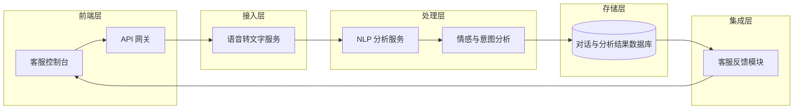

## 一、引言

本系统为智能客服语音分析系统，旨在对客服与客户的语音通话进行实时转写、情感与意图分析，并将分析结果反馈给客服人员，从而提升服务质量与客户满意度。

## 二、设计目标

1. **实时性**：支持分钟级、甚至秒级的语音转写与分析反馈。
2. **准确性**：高质量的语音识别与情感、意图分析，保证分析结果可靠。
3. **可扩展性**：模块化设计，支持水平扩展和功能迭代。
4. **高可用性**：设计冗余和容错机制，保障系统稳定运行。
5. **安全合规**：对语音数据进行加密存储与传输，满足隐私保护及相关法规要求。

## 三、系统总体架构



> **说明**：
>
> - API 网关：统一对外提供 RESTful 接口。
> - 语音转文字服务（ASR）：基于 Whisper 或商业 ASR 引擎。
> - NLP 分析服务：完成分词、意图识别、关键词提取。
> - 情感与意图分析：调用深度学习模型（BERT/GPT-4）进行分析。
> - 数据库：使用 SQLite（轻量级数据库）或 PostgreSQL 或 MongoDB 存储对话文本和分析结果。
> - 客服控制台：展示实时转写与分析结果、支持交互反馈。

## 四、模块设计

### 4.1 接入层

- **API 网关**：接收前端音频流，进行流量控制、鉴权和日志埋点。
- **负载均衡**：分发请求至多台 ASR 实例。

### 4.2 语音转文字服务（ASR）

- 基于 Whisper 模型进行批量和流式转写。
- 支持噪声抑制与多说话人分离。
- Output: 文本 + 时间戳。

### 4.3 NLP 分析服务

- **文本清洗**：去除停用词、特殊字符。
- **分词与词性标注**：调用 spaCy 或 jieba。
- **意图识别**：BERT Fine-tune 模型。
- **关键词提取**：TF-IDF / RAKE。

### 4.4 情感与意图分析

- **情感分类**：多分类模型（正面/中性/负面）。
- **语气强度评估**：回归模型输出情绪强度。
- **多轮对话状态跟踪**：存储上下文，辅助客服响应。

### 4.5 存储层

- **对话存储**：关系型数据库 PostgreSQL。
- **分析结果存储**：NoSQL（MongoDB）存储向量化内容和模型日志。
- **归档与备份**：定期冷存储至对象存储（如 MinIO）。

### 4.6 客服反馈模块

- 接收分析结果，通过 WebSocket 推送给前端。
- 支持客服标记纠错和用户满意度反馈。

## 五、技术栈

下面是一个基于 **PyQt5/ PySide2** 客户端框架，同时兼顾后端语音识别、NLP 分析与部署运维的技术栈推荐：

| 模块             | 技术选型及说明                                               |
| ---------------- | ------------------------------------------------------------ |
| 客户端 UI        | **PyQt5** 或 **PySide2**– 负责桌面端的可视化与交互，支持 WebSocket 或 HTTP 长轮询接收服务器推送。 |
| 网络通信层       | **FastAPI**– 高性能的异步 Python Web 框架，提供 RESTful 或 WebSocket 接口，方便与 PyQt 客户端对接。 |
| 语音转文字 (ASR) | **OpenAI Whisper**– 本地或容器化部署，支持流式和批量转写；也可选用腾讯云/阿里云 ASR 作为替代。 |
| 文本预处理／NLP  | **spaCy** + **jieba**（中文分词）– 高效的词法分析与分词；**Hugging Face Transformers**（BERT/GPT 系列）用于意图识别与关键词提取。 |
| 情感分析／意图   | **Hugging Face Transformers**– Fine‑tune 的 BERT/LLaMA 模型做多分类/回归；或用轻量级模型（如 TextCNN）。 |
| 模型推理         | **TorchServe** 或 **TensorFlow Serving**– 专业的模型在线推理服务，方便扩容与 A/B 测试。 |
| 数据存储         | **PostgreSQL**– 存结构化对话元数据与转写文本；**MongoDB**（可选）存储半结构化的分析结果与日志； |
| 消息队列／异步   | **RabbitMQ** 或 **Redis Streams**– 解耦客户端接入与后端处理，实现异步转写、分析与回调推送。 |
| 缓存／实时推送   | **Redis**– 存储会话状态、热点关键词；**WebSocket**（FastAPI + Starlette 支持）推送实时分析结果。 |
| 打包与分发       | **PyInstaller** 或 **cx_Freeze**– 将 PyQt 客户端打包成原生可执行文件； |
| 容器化／编排     | **Docker** + **Kubernetes**– 后端微服务容器化部署，支持水平扩展与高可用； |
| 日志与监控       | **Python logging** + **ELK**（Elasticsearch、Logstash、Kibana）**Prometheus** + **Grafana** |
| CI/CD            | **GitHub Actions** / **GitLab CI**– 自动化构建、测试与部署管道 |

**选型说明**

- **PyQt5/PySide2**：丰富的桌面控件，易于快速构建可交互的客服工作台；
- **FastAPI**：与 PyQt 客户端配合，通过 HTTP/WebSocket 实现低延迟双向通信；
- **Whisper + spaCy/Transformers**：从语音到结构化文本，再到深度 NLP 分析的一体化 Python 生态；
- **消息队列（RabbitMQ/Redis Streams）**：保证高并发情况下的稳定异步处理能力；
- **容器化与编排**：简化部署与运维，轻松扩容，保障系统高可用；
- **打包工具**：将桌面端直接发布给非技术背景的客服人员，无需额外环境安装。


## 六、部署与运维

1. **桌面客户端分发**

   - 使用 **PyInstaller** 将 PyQt 客户端一键打包成可执行文件（Windows EXE、macOS App、Linux 二进制）。
   - 直接将安装包上传至共享盘或内部下载页面，用户手动下载安装。

2. **后端部署**

   - 使用 **Docker Compose** 管理所有后端服务（FastAPI、Whisper、NLP 模型服务等）。

   - 在一台或几台虚拟机/云主机上运行，无需 Kubernetes，启动一条命令即可：

     ```bash
     docker-compose up -d
     ```

3. **CI/CD 流水线**

   - **GitHub Actions**：
     1. **Build**：当代码推送到 `main` 分支时，构建后端 Docker 镜像并推送到 Docker Hub。
     2. **Deploy**：通过 SSH 登录生产机，拉取最新镜像并重启容器。
   - 客户端更新可在 GitHub Releases 中发布新版本，手动通知用户下载。

4. **日志与监控**

   - **日志**：后端服务统一输出到标准输出，由 Docker 自动管理；可定期使用 `docker logs` 或简单脚本导出、归档。
   - **监控**（可选）：在同一 Docker Compose 中加入一个轻量级的 **Prometheus + Grafana** 服务，监控关键指标（CPU、内存、响应时间）。也可以先跳过监控，待需求明确后再补充。

5. **数据库与备份**

   - 使用单机 **PostgreSQL**（同样容器化），数据量不大时可不启高可用。

   - 定时在宿主机上用 `pg_dump` 导出快照，脚本配合系统 `cron` 即可：

     ```bash
     0 2 * * * docker exec my_postgres pg_dump -U user dbname > /backup/$(date +\%F).sql
     ```

6. **安全简化**

   - 在宿主机或一个轻量级 **Nginx** 容器中做反向代理，使用免费的 **Let's Encrypt** TLS 证书。
   - 配置 Docker Compose 中的环境变量和 `.env` 文件存放敏感信息，确保不上传到代码仓库。

------

这种方式无需学习复杂的编排系统，整个后端只依赖 Docker 与 Docker Compose，CI/CD 也可通过少量脚本实现，快速上线且易于维护。如后期规模增长，再逐步引入更完善的监控、高可用及自动化工具即可。

## 七、安全与合规

- **数据传输加密**：全链路 TLS。
- **敏感信息脱敏**：对用户个人信息做脱敏处理。
- **权限控制**：RBAC 控制 API 访问权限。
- **审计日志**：记录操作行为，满足合规需求。

## 八、扩展与前瞻

1. **多语言支持**：引入 Whisper 多语言模型。
2. **知识库接入**：结合企业内部知识库实现自动问答。
3. **语音合成（TTS）**：对客服响应进行合成，形成全程自动化对话。

## 九、附录

- **数据库表设计**
  - `conversations`：存储对话元数据。
  - `transcripts`：存储转写文本与时间戳。
  - `analysis_results`：存储情感、意图、关键词等。
  
- **API 接口列表**
  - `POST /api/asr/stream`：提交音频流。
  - `GET /api/conversations/{id}`：查询对话及分析结果。
  - `POST /api/feedback`：提交客服反馈。
  
  

###  项目文件树

~~~python
project-root/
├── ingress/                            # 4.1 接入层（API 网关 + 负载均衡）
│   ├── gateway/                        # API 网关 服务
│   │   ├── main.py                     # 启动脚本（接收音频流，鉴权、限流、日志埋点）
│   │   ├── routes.py                   # 路由 & 中间件
│   │   ├── auth.py                     # 鉴权逻辑
│   │   └── Dockerfile
│   ├── lb/                             # 负载均衡（可选：如果用 NGINX/Traefik）
│   │   ├── nginx.conf
│   │   └── Dockerfile
│   └── requirements.txt

├── service-asr/                        # 4.2 语音转文字服务（ASR）
│   ├── asr_server.py                   # Whisper 批量 & 流式转写入口
│   ├── noise_suppression.py            # 噪声抑制模块
│   ├── diarization.py                  # 多说话人分离模块
│   ├── utils/                          # 工具函数（音频预处理、分割、时间戳格式化）
│   ├── Dockerfile
│   └── requirements.txt

├── service-nlp/                        # 4.3 NLP 分析服务
│   ├── nlp_server.py                   # 接收文本，执行清洗、分词、意图 & 关键词提取
│   ├── preprocessing.py                # 文本清洗、去停用词
│   ├── tokenizer.py                    # spaCy / jieba 封装
│   ├── intent.py                       # BERT Fine‑tune 意图识别
│   ├── keyword.py                      # TF-IDF / RAKE 提取
│   ├── Dockerfile
│   └── requirements.txt

├── service-analysis/                   # 4.4 情感与意图分析
│   ├── analysis_server.py              # 情感分类、强度回归、多轮对话跟踪入口
│   ├── sentiment.py                    # 多分类情感模型
│   ├── intensity.py                    # 回归模型评估语气强度
│   ├── dialog_state.py                 # 多轮上下文管理
│   ├── Dockerfile
│   └── requirements.txt

├── storage/                            # 4.5 存储层
│   ├── postgres/                       # 关系型数据库初始化脚本
│   │   ├── init.sql                    # 表结构（对话、用户、反馈等）
│   │   └── Dockerfile
│   ├── mongodb/                        # NoSQL 存储（向量、日志）
│   │   └── Dockerfile
│   ├── minio/                          # 冷存储（对象存储）
│   │   └── Dockerfile
│   └── backup/                         # 备份脚本 & 配置
│       ├── backup_db.sh
│       └── cronjob.yaml

├── service-feedback/                   # 4.6 客服反馈模块
│   ├── feedback_server.py              # WebSocket 推送 & 纠错、满意度接口
│   ├── websocket.py                    # WS 管理
│   ├── models.py                       # Pydantic 模型（纠错、满意度）
│   ├── Dockerfile
│   └── requirements.txt

├── docker-compose.yml                  # 一键启动所有模块及存储依赖
├── .env                                # 环境变量（不提交仓库）
├── scripts/                            # 辅助脚本（部署、日志清理等）
│   ├── deploy.sh
│   └── cleanup_logs.sh

├── config/                             # 配置和运维相关
│   ├── prometheus.yml                  # （可选）监控
│   ├── grafana/                        # Grafana 仪表盘 JSON
│   └── nginx/                          # 公共反向代理配置（可复用于 ingress/lb）
│       └── default.conf

├── tests/                              # 测试
│   ├── asr/                            # ASR 单元与集成测试
│   ├── nlp/                            # NLP 服务测试
│   ├── analysis/                       # 情感/意图分析测试
│   └── feedback/                       # 反馈模块测试

└── docs/                               # 文档
    ├── module_design.md                # 模块设计说明
    ├── architecture.md                 # 系统架构图
    └── api_spec.md                     # 各服务接口文档

~~~


*文档完*